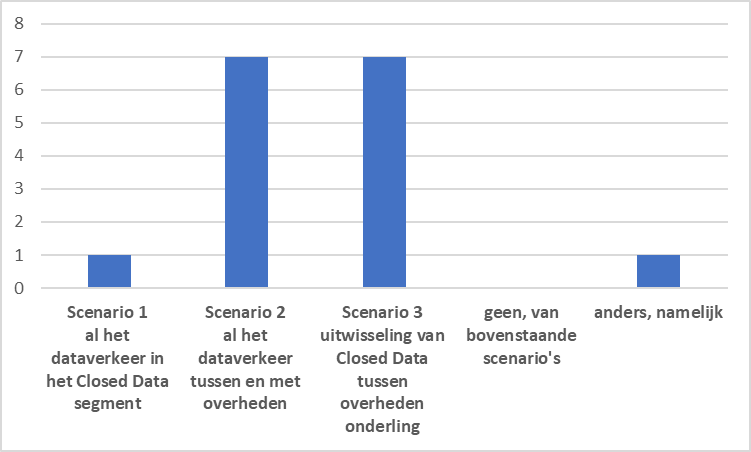

# Wat is de scope van Digikoppeling?

Hoewel Digikoppeling breder te gebruiken is, heeft de Nederlandse overheid bepaald dat voor een specifiek toepassingsgebied Digikoppeling verplicht moet worden toegepast. Dit zijn het functionele toepassingsgebied en organisatorische werkingsgebied zoals omschreven op de ‘pas toe of leg uit ‘-lijst van Forum Standaardisatie.

<table>
<tbody>
<tr>
<td>
<p><strong>Functioneel toepassingsgebied</strong></p>
</td>
<td>
<p>Digikoppeling moet worden toegepast op alle digitale gegevensuitwisseling met behulp van gestructureerde berichten die plaatsvindt met voorzieningen die onderdeel zijn van de GDI, waaronder de basisregistraties, of die sector-overstijgend is. Geautomatiseerde gegevensuitwisseling tussen informatiesystemen op basis van NEN3610 is uitgesloten van het functioneel toepassingsgebied.</p>
</td>
</tr>
<tr>
<td>
<p><strong>Organisatorisch werkingsgebied</strong></p>
</td>
<td>Nederlandse overheden (Rijk, provincies, gemeenten en waterschappen) en instellingen uit de (semi-)publieke sector.</td>
</tr>
<tr>
<td><strong>Waarvoor geldt de verplichting</strong></td>
<td>
<p>Digikoppeling is van toepassing bij aanschaf of ontwikkeling van systemen bedoeld voor gestructureerde berichtenuitwisseling met voorzieningen die onderdeel zijn van de GDI (zoals de basisregistraties) en berichtverkeer dat sectoroverstijgend is. Uitgezonderd zijn: de uitwisseling van Geo-informatie (daarvoor bestaat NEN3610) en de gevallen waarin de aanbieder van gegevens vaststelt dat geen noodzaak bestaat om de afnemer van de gegevens te authenticeren.</p>
</td>
</tr>
</tbody>
</table>

## Wat moet de Scope van Digikoppeling worden?

### inleiding

Een belangrijk kenmerk van Digikoppeling is dat het wordt gebruikt voor beveiligd gestructureerd berichtverkeer. In het toepassingsgebied komt het begrip ‘beveiligd’ vreemd genoeg niet terug. Toch is ook uit de Forum omschrijving wel af te leiden dat authenticatie en beveiliging een rol spelen bij de toepassing van Digikoppeling. Bij de uitzonderingen op de verplichting vermeldt het Forum dat Digikoppeling niet verplicht is als de aanbieder van gegevens vaststelt dat geen noodzaak bestaat om de afnemer van de gegevens te authenticeren.


Daarnaast worden er een aantal uitzonderingen genoemd die duidelijk maken dat er binnen de overheid ook andere standaarden worden gebruikt voor gegevensuitwisseling zoals NEN3610.

<table>
<tbody>
<tr>
<td> </td>
<td>
<div style="padding: 10px;">
<p>In de discussie maken we onderscheid tussen intern en externe uitwisseling van gegevens. Intern verkeer valt buiten de scope van Digikoppeling. <br /><br />Het is daarnaast handig om onderscheid te maken wie gegevens met een overheidsorganisatie uitwisselt:<br /><br /></p>
<ul>
<li>C2G: uitwisseling met personen (Citizens)</li>
<li>C2B: uitwisseling met bedrijven (Business)</li>
<li>G2G: uitwisseling overheidsorganisaties onderling (Government)</li>
</ul>
<br />
<p>Verder is het van belang om een scheiding te maken tussen <strong>Open en Closed Dataverkeer</strong>. Bij uitwisseling van Open Data worden niet-privacy gevoelige data uitgewisseld tussen partijen en gebeurt dit in de regel door een <em>anonieme</em> client. Closed data is vertrouwelijke data en vindt plaats tussen partijen die elkaar wederzijds kennen en hebben geauthenticeerd.</p>
</div>
</td>
</tr>
</tbody>
</table>

## Scenario's of alternatieven voor de scope van Digikoppeling

1. Uitwisseling van Closed Data met alle partijen.
1. Uitwisseling van alle externe dataverkeer met de overheid.
1. Uitwisseling van Closed Data tussen overheidsorganisaties onderling. Dit komt het meest over een met de huidige scope.


## VRAAG 1. Wat is voor mij de Scope van Digikoppeling?

1. De scope van Digikoppeling moet gaan over al het dataverkeer in het Closed Data segment (scenario 1).

2. De scope van Digikoppeling moet gaan over al het dataverkeer tussen en met overheden (scenario 2).

3. De scope van Digikoppeling moet gaan over uitwisseling van Closed Data tussen overheden onderling (scenario 3).

4. geen van bovenstaande.

5. Anders, namelijk

## Grafiek van de antwoorden



### Reacties

```
note: niet iedereen heeft bij deze vraag op- of aanmerkingen geplaatst. Bij de geplaatste opmerkingen is de scenariokeuze vermeld.
```

#### Scenario 2 (al het dataverkeer tussen en met overheden)

>(scenario 2) Het onderscheid binnen en buiten de overheid is steeds minder relevant. Gegevensregistraties en transactiesystemen van de overheid worden gebruikt door zowel andere overheden als door partijen buiten de overheid. Gedwongen daarbij een onderscheid maken is dubbel werk voor iedereen. Ondertussen blijft het wel relevant om een set standaarden te hebben die door iedereen in het netwerk toegepast kunnen worden.

>(scenario 2) opmerking: in veel client applicaties wordt altijd een combinatie van open en closed data getoond. indien al deze data met 1 standaard bij de overheid is in te zien is dat veel gebruiksvriendelijker dan wanneer verschillende standaarden gelden en er ergens moet worden beschreven wanneer je welke standaarden toepast.

>(scenario 2) Deze vraag heeft misschien ook een afhankelijkheid naar het beheervraagstuk, wie gaat de RESTful API standaarden en profielen beheren. Verder hebben verschillende RESTful standaarden een ander functioneel toepassingsgebied dan nu voor DK geldt. Naar ik begrijp wordt Logius verantwoordelijk voor beheer maar er is hiermee tevens behoefte aan een community die beheer/doorontwikkeling begeleid. Als dit het TO DK is dan lijkt het me logisch dat de scope van DK wordt aangepast naar #2 om ook aan te sluiten bij de functionele toepassingsgebieden van REST standaarden/profielen. Als er een ander gremium wordt ingericht dan kan dit #3 blijven maar moeten er wel duidelijke afspraken zijn hoe eea zich tot elkaar verhoudt. Verder is het wenselijk om generieke beveiligingsvoorschriften te hebben die voor DK als REST relevant zijn, bijvoorbeeld TLS. Ongeacht scope er is een noodzaak voor overzicht en samenhang

>(scenario 2) Er is steeds minder sprake van een verschil tussen binnen en buiten de overheid. Zeker nu ook private partijen subOIN's mogen aanvragen. Eenheid en afspraken over hoe het berichtenverkeer plaatsvindt is wel belangrijk.

>(scenario 2) Ondanks dat het over alle dataverkeer gaat, moeten profielen komen voor enerzijds open-data en anderzijds closed-data. Met de voorwaarden dat open-data niet beveiligd hoeft te worden, terwijl closed-data beveiligd moet worden.

#### Scenario 3 (uitwisseling van Closed Data tussen overheden onderling)

>(scenario 3) En bedrijven met een (deels) wettelijke taak en/of service providers onder verantwoordelijkheid van de overheid.

>(scenario 3) Inclusief (semi) publieke sector (!).
Ik twijfel tussen 1 en 3, want zie ook voordelen in het gebruik van digikoppeling standaard, inclusief authenticatie / beveiligingsaspecten, voor closed data segment tussen bedrijven en overheden / semi publieke sector.
>Citizens zullen niet zo vaak over digikoppeling faciliteiten beschikken, lijkt me.

>(scenario 3) Volgens mij kloppen de letters niet helemaal, zou moeten zijn C2G, B2G en G2G.
Scenario 1 is aantrekkelijk, maar dan zou je de DK standaard moeten uitbreiden met extra opties, met name voor C2G uitwisseling. En ook voor B2G zijn er veilige opties die nu niet onder de DK standaard vallen.
Het is overigens niet verboden om niet-privacy gevoelige data te versturen over een Digikoppeling verbinding.

>(scenario 3) Volgens mij is en moet de scope ook beperkt blijven tot closed data tussen overheden onderling. Met als kanttekening dat duidelijker moet worden dat als er een alternatief is (NEN3610 of API of ..) dat er géén verplichting is DK te gebruiken

>(scenario 3) Je moet geen voorzieningen gaan delen met de markt, mochten die in de standaard worden vastgesteld.
>Standaard afspreken zou nog kunnen, maar dit overleg heeft niet de capaciteit om die verplicht te stellen. Eerder volgt de overheid de markt-standaarden.

#### anders, namelijk

>_(anders, namelijk...)_ de scope van Digikoppeling zou naar mijn mening moeten zijn de uitwisseling van data tussen overheden onderling en met organisaties die een publieke taak vervullen. Dus voor de uitwisseling van gegevens tussen organisaties met een OIN. Of de data open of gesloten is maakt daarbij niet uit. Digikoppeling gaat over veilig transport tussen organisaties. Het kan best zijn dat ik als organisatie ook bij het opvragen van open gegevens zeker wil zijn van (a) de identiteit van de afzender en (b) dat de gegevens tijdens transport niet gewijzigd zijn. Ik kan dus besluiten dat ik de open gegevens via Digikoppeling wil ontvangen. De toepassing van Digikoppeling is dus niet onder te verdelen in transport van open of gesloten gegevens, er zijn andere overwegingen te maken voor de toepassing van Digikoppeling