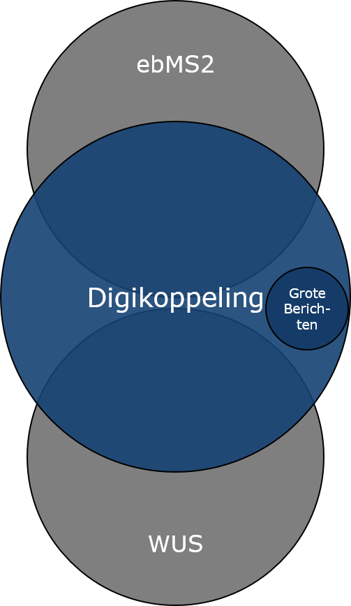
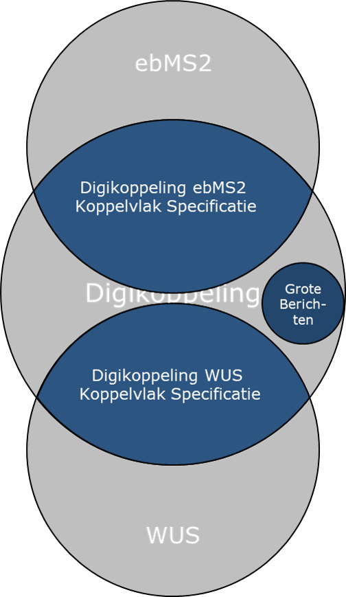

# Inleiding

## Waarom deze enquête?

Het Technisch Overleg Digikoppeling heeft Logius gevraagd te onderzoeken of op termijn API’s als koppelvlak opgenomen kunnen worden in Digikoppeling. Om invulling te geven aan dit verzoek wil Logius graag een goed beeld hebben hoe de verschillende belanghebbenden de opname van een API koppelvlak voor zich zien en waar zij uiteindelijk het meest mee geholpen zijn. Tegelijk moet Digikoppeling een open en gedragen standaard blijven tijdens en na deze uitbreiding.

In deze enquête hebben we daarom een aantal vragen op een rij gezet die helpen om in eerste aanzet de scope en omvang van deze oefening te bepalen.

In deze enquête stellen we een aantal oriënterende vragen over Digikoppeling, om te onderzoeken hoe we REST api's kunnen onderbrengen in de Digikoppeling Standaard. Deze enquête bevat 5 segmenten en totaal 6 vragen.

Voordat we een aantal vragen stellen, eerst enige informatie over de Digikoppeling standaard, om het geheugen op te frissen.

## Wat is Digikoppeling?

|--|--|
|one|two|

| Standaard| Digikoppeling| Koppelvlakspecificatie |
|---|---|---|
||Digikoppeling is een verzameling van een aantal standaarden en afspraken, ebMS2, WUS en Grote Berichten. Digikoppeling maakt het mogelijk dat organisatie interoperabel, veilig en betrouwbaar gegevens kunnen uitwisselen. ||

Digikoppeling regelt:
    identificatie (van organisaties met het OIN )
    authenticatie (via Pkioverheid certificaten)
    vertrouwelijkheid (tweezijdig TLS )
en biedt aanvullende mogelijkheden voor end to end integriteit, onweerlegbaarheid, verdergaande vertrouwelijkheid (via signing en encryption) Digikoppeling bevat profielen, vaak inperkingen op de internationale standaarden ebMS2 en WUS (eigenlijk de WS-I profielen BP 1.2 en BSP 1.1). De Digikoppeling Grote Berichten standaard is niet gebaseerd op een internationale standaard. Digikoppeling Grote berichten is een Nederlandse afspraak gebaseerd op het Claim Check Patroon.
