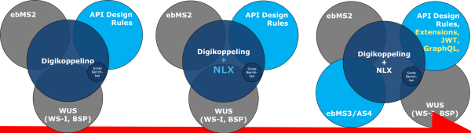

# Waar willen we heen met Digikoppeling?

Onderstaand is een schets welke vragen wij als beheerder hebben over het inbedden van API's en de verdere ontwikkelingen. We zijn natuurlijk benieuwd wat jullie mening hierover is

<table>
<tbody>
<tr>
<td>

<strong>1. Inbedden API Design Rules in Digikoppeling</strong>

</td>
<td><strong>2. Wat is de rol van NLX?</strong></td>
<td><strong>3. De ontwikkeling van API standaarden gaan hard</strong></td>
</tr>
<tr>
<td>

We willen de ontwerpafspraken die nu gemaakt zijn in de (RESTful) API Design Rules (ADR) opnemen als standaard binnen Digikoppeling. Ook op de ADR zal in Digikoppeling een profiel worden opgesteld, bijvoorbeeld om het gebruik van 2 tweezijdig TLS te verplichten en de rol van het OIN te verduidelijken in het uitwisselen van informatie.

Met klem wijzen we erop dat we niet willen afwijken van de ADR, maar er enkel extra eisen op willen stellen die op dit moment nog niet gelden voor de ADR, zoals voor tweezijdig TLS. In de Extensies op de ADR zijn wel al eisen voor beveiliging. De extensies zijn echter nog geen onderdeel van de ADR.

Met het opnemen van de ADR in Digikoppeling kunnen gebruikers hun API Clients en Serviceoplossingen gebruiken voor zowel Open als Closed Data. Voor API koppelvlakken op gebieden waarvoor het gebruik van Digikoppeling verplicht is kunnen de extra eisen die Digikoppeling stelt in de configuratie worden opgelost.

</td>
<td>

VNG/Common Ground is nu druk bezig met het opzetten van een uitwisselingsnetwerk op basis van NLX, de Nederlandse X-road. Een vergelijking tussen Digikoppeling en NLX is lastig te maken, NLX is nu vooral een implementatie op basis van open source componenten en Digikoppeling is een papieren standaard.   Gebruikers zijn echter gebaat met duidelijkheid welke oplossing(en) ze voor hun gegevensuitwisseling kunnen mogen of moeten gebruiken.

Bij de opname van RESTful API's binnen Digikoppeling moet aan deze symbiose aandacht worden gegeven.

</td>
<td>

De ADR bevatten nu een verzameling regels waarover brede consensus bestaat zodat ze dit jaar kunnen worden opgenomen op de lijst van verplichte standaarden van het Forum Standaardisatie, de Pas-toe-of-Leg-uit lijst.

Maar Standaarden zijn in ontwikkeling. De ADR kent extensies waarover de discussie nog gaande is. Binnen de werkgroep Security van het Kennisplatform API's wordt gekeken naar een JSON Webtokens (JWT) voor signing en encryption. Sommige organisaties experimenteren met GraphQL, een standaard voor het flexibel uitvragen van gegevens.

Ook aan de kant van berichtenuitwisseling zijn er ontwikkelingen, zoals het ebMS3/AS4, de opvolger van ebMS2. de EU heeft op deze standaard het eDelivery profiel ontwikkeld, dat waarschijnlijk binnen Digikopeling als standaard kan worden opgenomen.

</td>
</tr>
</tbody>
</table>

## Vraag 3. Mijn visie op de toekomst of evolutie van Digikoppeling

### Reacties

>Alles opnemen wat gaat over het makkelijker / goedkoper uitwisselen van gegevens tussen overheden en met de overheid. Wat mij betreft voor open data, maar ook beveiligd met end-to-end encryptie en signing. En niet alleen papier maar ook ondersteuning met open source implementatie die het makkelijker maakt om systemen veilig en betrouwbaar te koppelen.

>De oorspronkelijke visie op Digikoppeling was (en is volgens het functionele toepassingsgebied): uitwisseling van gegevens binnen de overheid. Het middel dat daarbij gekozen wordt is het definiëren van een gezamenlijke architectuur, een aantal interoperabiliteitsprofielen en het organiseren van overleg- en besluitvormingsstructuren daaromheen.
>Het opnemen van RESTful profielen past volledig binnen deze oorspronkelijke doelstelling.
De beweging moet zijn: niet koste wat kost de huidige technologische keuzes handhaven (ebMS en WUS), maar binnen de doelstellingen (veilig, betrouwbaar, interoperabel) actief doorontwikkelen zodat deze actueel en toepasbaar blijven - binnen de architectuur (federatief, dunne bus, …)
(NB: de consequentie gaat dan dus zijn dat ebMS richting uitfasering gaat (vervangen door eDelivery), en dat een REST-profiel erbij komt)."

>Schoenmaker houd je bij je leest. In hoeverre zien we ADR in dezelfde context als de DigiKoppeling standaard, waarbij transport, logistiek en beveiliging worden gedekt. 
>Uiteraard moeten technologische ontwikkelingen worden gevolgd, maar dan getoetst en eventueel opgenomen worden binnen de transport, logistiek en beveiligings-scope  van DK.
De laatste evolutie met de grote berichten (push) standaard had naar mijn mening alleen een praktische invulling mogen zijn van de standaard, maar niet een standaard op zich, Het is alleen introduceert om geen ebMS te hoeven implementeren. 
>De principes van bevragingen en meldingen zouden meet gehandhaafd mogen worden. "
>
>Straks RESTFul API naast WUS/ebMS.
>Daarna JSON naast XML"
>
>Niet te breed trekken met NLX. Er kunnen meer standaarden op segmentniveau zijn maar belangrijk is één centraal gedefinieerde standaard. Dus ad 1. heeft mijn voorkeur met inachtneming van FS geadopteerde standaarden.

>Digikoppeling is een prima concept, wat in mijn beleving niet teveel op de schop hoeft. Natuurlijk wel belangrijk om mee te bewegen met de tijd.
Wellicht belangrijkste: behoudt aandacht voor en focus op interoperabiliteit!
>De ideeën die hier worden genoemd, lijken mij verstandig. REST API's zijn voor veel zaken veel makkelijker te implementeren dan EBMS2, maar niet perse voor elke situatie ideaal. EBMS2 en WUS hebben ook voordelen, al verwacht ik dat WUS plaats zal gaan maken voor REST API's. Voor asynchrone data / bestands uitwisselingen is EBMS2 gewoon een prima protocol wat veel organisaties in place hebben en het werkt. Overgaan naar EBMS3 lijkt mij niet echt prioriteit hebben, natuurlijk zou het voor sommige beheer organisaties prettig zijn (ipv EBMS2 & 3 ondersteunen), maar het zal een heel flinke klus worden en in de praktijk zal gewoon niet alles gemigreerd worden.
>De ADR stelt in mijn ogen dat REST APIs ook echt REST APIs moeten zijn, weer een goede zaak. Het opnemen dat closed data REST API's onder digikoppeling minimaal tweezijdige TLS moeten gebruiken lijkt mij ook een goed.
Verder lijkt het mij niet direct verstandig om teveel extra beperkingen / regels op te leggen voor REST API's, maar best practices zijn wellicht wel handig. Bijvoorbeeld de JSON webtokens.
>Hoop dat dit een beetje een coherent beeld geeft. Ik zou zeggen ga zo door. Blijf ook kritisch in wat Digikoppelign wel en niet moet regelen, betrek het TO daar ook bij.

>Digikoppeling wordt meer een paraplu begrip met daaronder een steeds grotere verscheidenheid met profielen. De architectuur moet beschrijven wat de situaties zijn waarin verschillende profielen worden ingezet.
>per profiel moet duidelijk zijn wat de roadmap en status is. Wanneer is een profiel EOL (end of life) en wanneer is een profiel volwassen genoeg en om te kunnen worden toegepast, wat is de mate van adoptie en implementatie etcetera.
>ook moet van historische en nieuwe kandidaat profielen duidelijk zijn wat de feiten en meningen zijn. 
>Ik wil vooral in 1 overzicht lezen waarom: 
>- WSRM niet is doorgezet
>- wanneer WUS EOL is
>- wat Digikoppeling vindt van NLX
>- Waarom het x-road profiel afwijkt van DK
>- waarom Queueing zoals AMQP geen onderdeel is van de standaard.
>- wat de mening is van VNG over de ebMS 3 standaard
>- of graphQL een potentieel profiel is van DK"

>Ik denk dat DK een standaard moet blijven die onafhankelijk is van producten. Producten komen en gaan, organisaties moeten investeren in de ondersteuning hiervan, door zelf kennis op te bouwen of door support te regelen van een leverancier (licenties). Organisaties moeten daar vrij in zijn en blijven. Dus ik zou geen verband wensen tussen DK en NLX. Een standaard die door slechts één product wordt ondersteund is niet nuttig als standaard (schrijf dan gewoon het product voor). 
>
>Uitbreidingen op de DK standaard (inclusief de API standaarden) moeten worden getoetst, voordat ze als verplichting kunnen worden opgelegd. 'Dit lijkt leuk en modern' is geen motivatie. Een uitbreiding moet voldoen aan de doelstellingen van DK en er moet behoefte aan zijn, naast hetgeen er al is."

>Heeft dus relatie met antwoord op vraag 1. Lijkt er op dat de keuze is dat eea geïntegreerd wordt binnen DK (community) en dat is prima als de community de betreffende expertise heeft, beveiliging in het algemeen en de hoe dit in verschillende internationale standaarden vorm wordt gegeven .
>Een goede structurering is het belangrijkste. Deze basis moet het mogelijk maken om flexibel te zijn en om kunnen gaan met nieuwe ontwikkelingen. Zo zou er een generieke basis kunnen zijn die nu deels door de DK beveiligingsvoorschriften worden ingevuld. Hierbij spelen ook PKI en OIN een belangrijke rol, maar in hoeverre past dit binnen verschillende RESTful standaarden (werken met tokens en authorization server). Kans is dat je dezelfde functionaliteiten op meerdere niveaus gaat inrichten. De eerste stap moet een goed meta model zijn hoe eea door verschillende standaarden ingevuld wordt en hoe deze samenhangen

>EBMS3/AS4 heeft voor mij lage prioriteit, API (ADR) + extensions hoge prioriteit

>Volgens mij is het verstandig om onderscheid te maken tussen de standaarden (beheerd door internationale organisaties) en het beheer van de DK standaard (beheerd door Logius)
> 
>Discrepantie in het plaatje:
>- Digikoppeling standaardaardiseert de te gebruiken profielen in de internationale standaarden WUS en ebMS
>   - Logius beheert de profielen en te gebruiken versies
>- ADR standaardiseert ontwerprichtlijnen en profielen van de internationale API standaarden
>   - gaat Logius ADR beheren?
>   - gaat Logius een ADR profiel beheren (bv. welke extensies wel en niet)?
> - NLX als product past niet in de huidige DK standaard. Wat wordt de rol van Logius voor NLX? Wat levert Logius vwb NLX:
>   - opname NLX product in DK standaard, verplichting/aanbeveling om NLX te gebruiken?
>   - welke versie van het NLX product? Wat bij breaking changes in onderliggend (maatwerk) NLX protocol?
>   - wie is verantwoordelijk voor de centrale NLX voorzieningen (certificaten, directory, dashboard, ..)?
>   - wat wordt de rol van leveranciers?
>   - etc
> - ebMS3 is geen 'andere' standaard, hoort in één bolletje bij ebMS2.
>  
> Ik denk dat het goed is dat ADR onder de vlag van DK meegaat. Wel het risico dat de bestaande DK standaarden onevenwichtig veel aandacht krijgen in huidige gremia. Zorg voor evenwicht hier. Alternatief is dat DK en ADR als concurrerende standaarden gezien gaan worden. Lijkt mij niet gewenst
> 
> DK gaat actief de migratie van DK naar ADR omarmen. Voor nieuwe koppelingen heeft ADR de voorkeur boven WUS en ebMS. Volg kritisch de ontwikkelingen op het gebied van API's en REST en neem deze op in ADR extensions en daarna als DK profiel?
> 
>De DK standaard wordt al breder, met meerdere keuzen. Belangrijk om helderheid te geven in wanneer welke standaard voorkeur heeft. Ook belangrijk om actief lifecycle management te gaan doen en te bepalen vanaf wanneer een standaard niet meer ondersteund wordt. 
> 
> Onderscheid tussen raadplegen en melden is laatst weer bediscussieerd. Ga de architectuur hierarchter actualiseren en kijk daarbij vooral ook naar nieuwe ontwikkelingen zoals Haal Centraal en de nieuwe ZGW API (zaakgericht werken). Met een nieuwe blik op meldingen, ga nadenken over het uitfaseren van ebMS."

>Ik ben van mening dat het realiseren van interoperabiliteit altijd op basis van afspraken of standaarden zou moeten worden gerealiseerd ("Afspraken voor Standaarden voor Voorzieningen"). Het opnemen van APIs binnen Digikoppeling lijkt mij een haalbaardere weg om te begaan dan het trachten één voorziening hiervoor te realiseren (NLX). Het lijkt mij ook ongewenst om twee concurrende standaarden te hebben voor het gebruik van APIs binnen het overheidslandschap. Duidelijk is vereist en gezien de positionering van Digikoppeling is opname van APIs binnen deze standaard een logische stap.

>Digikoppeling (of een andere naam..) zou duidelijkheid moeten geven hoe gegevens wordt uitgewisseld met of tussen overheden. Dit ksn door afspraken en standaarden onder te brengen onder 1 vlag. Ik zie voor me dat je als gebruiker kunt kiezen tussen verschillende opties (ebMS,WUS,REST, NLX, etc?) en dat er duidelijkheid wordt gegeven welke oplossing voor welke toepassing het beste bruikbaar is. Gekeken moet worden welke ontwikkelingen er spelen en waar behoefte aan is. Als dat betekent dat een standaard niet of nauwelijks meer wordt gebruikt kan deze uitgefaseerd worden.

>Het geschetste pad kan werkelijkheid worden. Er zijn al ontwikkelingen rondom NLX, Common Ground, etc. die tot een gezamenlijke afsprakenset zal leiden.

>Wij zullen vooral WUS en API gaan gebruiken, dus API standaarden opnemen Ja.
NLX niet opnemen als standaard of verplichting overheidsbreed.
Extensies toepassen gebeurd al binnen API NL overleg, prima om op die manier flexibeler/sneller te kunnen acteren op marktontwikkelingen.
JWT gaan wij zeker gebruiken.

