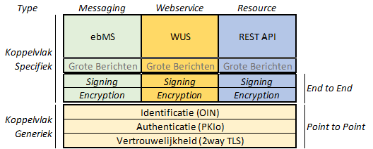

# Hoe gaan we API's onderbrengen in Digikoppeling?

De Digikoppeling standaard maakt nu vooral onderscheid tussen Bevragingen en Meldingen en koppelt hieraan de onderliggende standaarden ebMS en WUS. Dit blijkt in de praktijk niet altijd te werken. Is het verstandiger om onderscheid te maken op andere vlakken, zoals bijvoorbeeld Messaging, Webservices en Resources? Dit biedt mogelijkheden om een balans aan te brengen in de standaarden (zie het plaatje hieronder), maar heeft het nadeel dat dit op plekken wringt omdat we appels met peren (en citroenen) willen vergelijken.

## Vraag 4. Mijn voorstel hoe we Restful APi's gaan opnemen in Digikoppeling is:

### Reacties 

>Ik zou afstappen van meldingen en bevragingen.
>En onderscheid maken in synchroon (zoals bellen) en asynchroon (zoals sms-en), en reliable / niet-reliable.
En alles kan met/zonder authenticatie (ondertekening/meesturen wachtwoord) en beveiliging (encryptie).
> 
>En SOAP/REST_JSON kan dan naast elkaar bestaan.

>1. het onderscheid tussen bevraging en melden is verouderd, en moet er uit. Het is prima mogelijk om in elke stack een push- en een pull-pattern te implementeren. Zie bijvoorbeeld het Digipoort WUS voor bedrijven-koppelvlak (afgeleid van Digikoppeling WUS) dat 'meldingen' door bedrijven van oudsher binnen de WUS-stack afwikkelt.
>2. het koppelen van de technologische implementatie aan het 'type' (messaging, webservice, resource) lijkt niet verstandig, omdat de terminologie niet eenduidig te krijgen is. Beter is om een aantal karakteristieke patronen in gegevensuitwisseling te vertalen naar profielen voor elk type stack. En daarbij eventuele beperkingen aan te geven (zoals: reliable messaging over een WUS-stack) en eventuele oplossingsrichtingen/aanwijzingen/best practices te geven hoe hier mee om te gaan.

>Geef aan op basis van de business case wanneer welke technologie toegepast dient te worden. 
>Voeg een principe toe (naast bevraging en melding) waarmee REST geïmplementeerd kan worden als DK standaard.

>Huidige invulling van de begrippen Bevraging en Melding is niet conform industrie standaard.
>Maak een onderscheid tussen:
> * doel (registreren/corrigeren; bevragen; downloaden), 
> * interactiepatroon (asynchroon; synchroon met directe verwerking; synchroon met uitgestelde verwerking) 
> * en transport (ebMS/WUS/REST)
> 
> Vervolgens ebMS/WUS/REST naast elkaar als volwaardige alternatieven voor alle doelen en onder alle interactiepatronen.

>Er geen 'labeltjes' aan hangen maar het als een menukaart zien met standaarden die allemaal op gebieden sterke en zwakke punten hebben en ieder hun eigen platform eco-systeem. Zoiets als Azure, AWS en Gcloud naast elkaar.

>Dit is een interessante vraag, lastig om daar even snel antwoord op te geven.
>  
>Gut feeling voor een meer 'rechtdoende' onderverdeling:
> 
>Messaging rondom asynchrone processen: EBMS
> 
>Bevragen van gestructureerde datasets: WUS
>(ivm de voordelen qua specs die SOAP en xml bieden)
> 
>Eenvoudige API's: REST.
>
> --
> 
> Misschien niet teveel uitputtend willen beschrijven wanneer je wat moet gebruiken, want het is wijsheid om daar voor elke koppeling elke keer goed over na te denken. 

>Digikoppeling is bedoeld voor het stelsel van basisregistraties. vrij vertaald is dat toegang regelen tot de data in de database van een andere organisatie (of je eigen organisatie als je zelf een basisregistratie bent). Ik zou de focus niet leggen op Restful API's maar op de Create, Read, Update en Delete operaties op de records in de dataset. Daarnaast is een system of transactions nodig om aantoonbaar te maken wie welke operaties wanneer heeft uitgevoerd. Messaging is niets anders dan het uitvoeren van 2 operaties en het vastleggen van de transacties. hetzelfde resultaat kan worden bereikt met een webservice of de aanroep van een resource dmv een REST api.
> 
>een restful api is niet vergelijkbaar met meldingen of bevragingen of met het begrip Messaging of Webservice. Het moet meer basaal worden beschreven in termen wat je functioneel wilt bereiken en hoe je dat technisch doet. 
> 
>bijvoorbeeld: ik wil dat alle WOZ waarden van de 355 gemeenten in de LVWOZ komen te staan. Technisch gezien kan je ebMS toepassen om van elke gemeentelijke WOZ dataset een kopie aan het kadaster te sturen (de huidige situatie). Je kan ook de webservice van het kadaster aanroepen om daar voor elk WOZ object een record weg te schrijven en daarna op te vragen of alle objecten die je zelf hebt ook bij het kadaster staan (de gewenste situatie)  of je informeert het kadaser dat je een API hebt waarmee het kadasetr naar wens zelf de actuele gegevens van de WOZ objecten op kan halen bij de gemeenten (de ideale rest situatie).
>
>Het doel moet ook zijn om te bevragen (en muteren) bij de bron en voorkomen dat er kopieën worden gemaakt indien dat niet wettelijk vereist is."

>Dit lijkt me een goede opzet.
>De eerder genoemde kern is: interoperabel, veilig en betrouwbaar verkeer o.b.v. identificatie, authenticatie en vertrouwelijkheid. Dit is in bovenstaand schema terug te vinden, maar ik mis het aspect 'betrouwbaar' nog (de zekerheid dat het aangekomen en verwerkt is). Bij ebMS wordt het afgedekt, bij WUS en REST API moet de response het afdekken, denk ik. 
>Vragen hierbij:
>Is de keuze tussen ebMS, WUS en REST dan vrij of gaat DK daar een voorschrift/richtlijn/advies voor opnemen?
>Betekent REST API ook automatisch JSON? Of is XML ook mogelijk.
>Moet een aanbieder voor elke koppeling zowel ebMS, WUS als REST ondersteunen, of is hij daar vrij in?

>Volgens mij is juist in TO DK al besproken dat er geen indeling is met ebMS voor meldingen en WUS voor bevragingen, beide profielen kunnen zowel meldingen als bevragingen ondersteunen.
> 
>Het plaatje sluit aan op mijn antwoord bij 3, maar is nog niet de juiste indeling, dit moet in gezamenlijkheid ontwikkeld worden en vormt een belangrijke basis hoe met de vraagstukken om te gaan"

>Het voorgestelde plaatje spreekt mij wel aan.

>In de figuur ontbreekt het belangrijkste stuk, namelijk bovenin de business transaction.
>
>Wees kritisch in het gebruik van technologie die een oplossing bieden voor werken over onbetrouwbaar netwerk of het opvangen van onbeschikbaarheid. Gegarandeerd transport (fire and forget) is vooral bedoeld om onafhankelijk van de service te kunnen doorwerken. Met alle complexiteit van dien , waarbij niet in het minst het asynchroon afhandelen van verwerkingsfouten ...
>
>Mutaties kunnen als business transacties synchroon worden uitgevoerd. In plaats van gegarandeerde aflevering, wordt gecontroleerd of de mutatie correct is verwerkt. 
>
>REST kan gebruikt worden voor synchroon bevragen en muteren. 
>
>Daarnaast is er behoefte aan notificeren over gebeurtenissen. Hier wordt binnen Haal Centraal nu aan gewerkt met een PoC voor event logging. In plaats van resources wordt dan gekeken naar feiten die optreden. Ook een extensie, net als GraphQL? Of iets heel anders.
>
>En er is behoefte aan het kunnen synchroniseren van gegevensverzamelingen voor analyse (BI).
>
>De vraag is niet welke typen protocollen DK ondersteunt (messaging, webservice, resource, feit, ..), maar welke typen business transacties er zijn, wat de eisen zijn en welke protocollen (bij voorkeur) gebruikt worden. "

>De opdeling tussen WUS en ebMS in Digikoppeling heeft nu met name te maken met de opdeling in synchroon en asynchroon verkeer en hieraan gekoppeld de problematiek ten aanzien van betrouwbaarheid en formaliteit. Ik denk dat het meer van belang is om te schetsen hoe Restful APIs hierin passen. Is asynchroon verkeer tussen organisaties bijvoorbeeld implementeerbaar via APIs of verplichten we hiervoor ebMS? Het gaat dus niet alleen om het inbedden van een standaard binnen Digikoppeling maar ook het schetsen van de toepassing hiervan.
>
>Ik zou overigens verwachten dat binnen Digikoppeling een http-profiel wordt gedefinieerd voor het gebruik van APIs wat afgestemd is op de ADR. "

>Goede vraag, geen idee :-) 

>Wij zijn eens met het plaatje. Er moet een onderscheid gemaakt worden tussen deze 3 gebieden.
>Er moet apart een resource-based profiel beschreven worden op basis van Restful API. Hierbij moet er speciale aandacht worden besteed aan Notificatie en/of Meldingen.

>Beschrijf per protocol de stack, maar laat de koppeling met de toepassing los (messaging, ...).
>Doe geen verplicht gebruik op messaging ed., maar stel best-practices op voor het gebruik.
>Voor specifieke business cases kunnen er bilaterale afspraken voor de implementatie gemaakt worden, bv. t.a.v. terugmeldingen.
>Partijen blijven dan in de aanpassing van implementaties en migraties daarvan wat onafhankelijker en nieuwe inzichten kunnen sneller worden omgezet in betere oplossingen.

