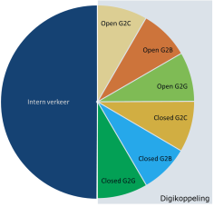
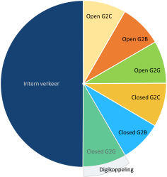

## Digikoppeling en Restful Api's

## Agenda

Doel: mening peilen van de Digikoppeling Comunity hoe APi's in te bedden in de standaard

- Terugkoppeling Enquête
- Bespreken onderwerpen
  - Verduidelijking behoefte Digikoppeling
  - Scope Digikoppeling
  - Profiel op API Design Rules
- Afspraken voor vervolg

## Terugkoppeling Enquête

De enquête is verstuurd naar actieve leden van het Technisch Overleg Digikoppeling

|aantal| #|
|---|---|
|aantal verstuurd:| 29|
|aantal reacties ontvangen:| 16 |

## Wat moet de scope van Digikoppeling zijn? 1

## Wat moet de scope van Digikoppeling zijn? 2

| scenario 2| scenario 3|
|:---:|:---------------------------:|
|||
|onderscheid maken steeds minder relevant|ook voor (semi) publieke sector en serviceproviders|
|gebruik registraties en transactiesystemen van de overheid door zowel overheden als private partijen|er een alternatief is (NEN3610 of API of ..) géén verplichting|
|profielen voor open als closed data nodig|geen voorzieningen delen met de markt|

## Behoefte waarin Digikoppeling voorziet

Standaardisatie leidt tot 

- meer duidelijkheid
- betere interoperabiliteit
- eenvoudiger toegang tot gegevens
- lagere kosten
- veiligheid 
- betrouwbaarheid

## Waar willen we heen met Digikoppeling?

Verschillende opvattingen. 
Het is lastig een tendens te herkennen of een gezamenlijk thema te ontwaren: 

- Behoud het voordeel van een gedragen standaard
- het inbedden van Restful APi's is gewenst
- liever geen product, maar blijf bij een specificatie
- volg de praktijk op de voet.

## Hoe moeten we Restful APi's opnemen in Digikoppeling?

- Maak geen onderscheid in meldingen en bevragingen. 
- beschrijf interactiepatronen, en usecase voor CRUD, Resources en betrouwbaarheid. 
- Beschrijf best practices voor business transactions.

## Nabranders

- zorg dat er voldoende referentie-implementaties en testmiddelen zijn om de conformiteit aan de standaarden/profielen te testen.
- onderzoek ook specifiek de rol die intermediairs kunnen hebben in het ecosysteem
- het moet duidelijk zijn wat je met een API wel kan wat met ebMS of WUS niet kan in functionele of non functionele zin
- met NLX kan je een API 6000x per seconde aanroepen, met DK kan je 6 ebMS berichten per seconde uitwisselen.
- dit roept wel weer vragen op hoe de DK architectuur zich verhoudt tot NORA en de NORA katernen.

en gelukkig ook:

- veel succes

## Oordeel over deze enquête

## Vragen 

volledige uitwerking

<http://test-docs.centrumvoorstandaarden.nl/Overige/Enquete-RESTful-APIs-in-Digikoppeling/Enquete-RESTful-APIs-in-Digikoppeling-0.20/>

deze presentatie
<todo>

## Discussie

## Verduidelijking behoefte Digikoppeling

## Scope Digikoppeling

## Profiel op API Design Rules

## Hoe verder

uitwerken resultaten
volgende meeting TO in September

