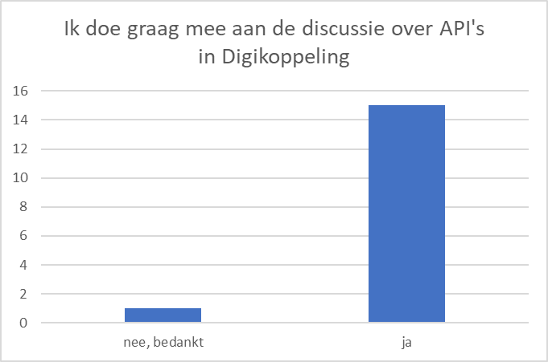
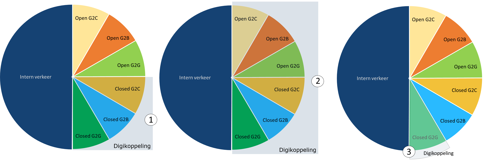
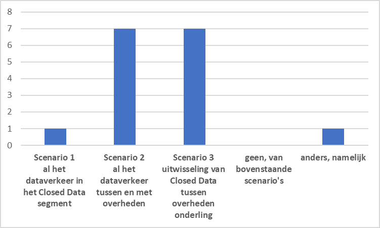
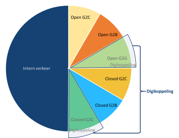
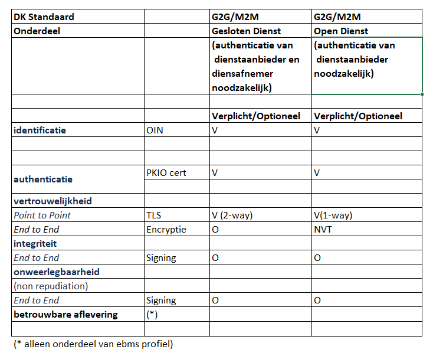
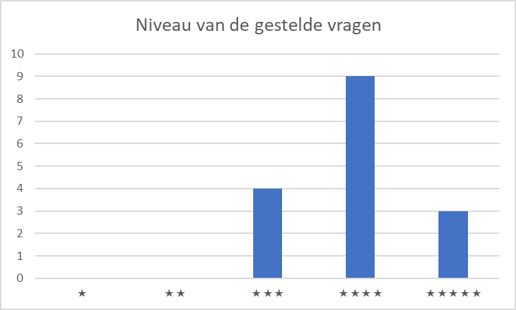
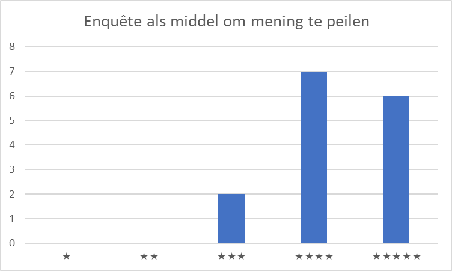
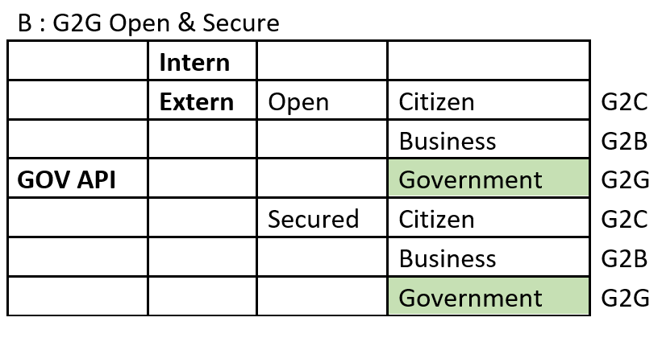

## Digikoppeling en Restful Api's

## Agenda

Doel: Bepalen hoe APi's in te bedden in de standaard

- Terugkoppeling Enquête
- Bespreken onderwerpen
  - Bespreken van de scope
  - Herzien Digikoppeling Architectuur
- Afspraken voor vervolg

## Terugkoppeling Enquête (1)

De enquête is verstuurd naar actieve leden van het Technisch Overleg Digikoppeling

|aantal| #|
|---|---|
|aantal verstuurd:| 29|
|aantal reacties ontvangen:| 16 |

## Terugkoppeling Enquête (2)

## Wat moet de scope van Digikoppeling zijn? (1)

## Wat moet de scope van Digikoppeling zijn? (2)

## Wat moet de scope van Digikoppeling zijn? (3)

**Scenario 2** *(al het verkeer met de overheden)*

- onderscheid maken steeds minder relevant
- gebruik registraties en transactiesystemen van de overheid door zowel overheden als private partijen
- profielen voor open als closed data nodig|

## Wat moet de scope van Digikoppeling zijn? (4)

**Scenario 3** *(Uitwisseling van closed Data tussen overheden onderling)*

- ook voor (semi) publieke sector en serviceproviders
- Als er een alternatief is (NEN3610 of API of ..) géén verplichting
- geen voorzieningen delen met de markt

## Eén ander scenario werd genoemd

- de uitwisseling van data tussen overheden onderling en met organisaties die een publieke taak vervullen. Of de data open of gesloten is maakt daarbij niet uit

## Toelichting 

Het kan wenselijk zijn om 'open data' wel via een betrouwbaar/veilig kanaal te ontvangen omdat het 'kritisch' is voor de bedrijfsprocessen van een organisatie;
(bv zekerheid van afzender en integriteit van de data).
Het onderscheid tussen open en gesloten diensten is daarom geschikter dan het onderscheid tussen open/gesloten data
- Open Diensten : overheidsdiensten die publiek toegankelijk zijn
- Gesloten Diensten : overheids diensten die toegankelijk zijn voor bepaalde afnemers (bv overheden G2G)

## Profielen voor DK G2G Open/Gesloten Diensten

## Opmerkingen bij scenario DK G2G Open/Gesloten Diensten

- Omdat deze scope G2G publieke diensten invult, wordt eigenlijk het gehele publieke vlak ingevuld: G2x Open Diensten
- DK krijgt hiermee 2 functies:
  - Wat gebruik je voor publieke diensten (G2x)
  - Wat gebruik je voor G2G 'gesloten' diensten  
- Huidige PTLU scope sluit gevallen waar geen authenticatie van afnemers nodig is juist uit van verplicht gebruik van DK
- Vraag is (dus) of deze scope / indeling voordelen biedt?
(in vergelijking met een focus op G2G gesloten diensten)

## Behoefte waarin Digikoppeling voorziet

**Standaardisatie leidt tot**

- meer duidelijkheid
- betere interoperabiliteit
- eenvoudiger toegang tot gegevens
- lagere kosten
- veiligheid 
- betrouwbaarheid

## Waar willen we heen met Digikoppeling?

Verschillende opvattingen. 
Het is lastig een tendens te herkennen of een gezamenlijk thema te ontwaren: 

- Behoud het voordeel van een gedragen standaard
- het inbedden van Restful APi's is gewenst
- liever geen product, maar blijf bij een specificatie
- volg de praktijk op de voet.

## Hoe moeten we Restful APi's opnemen in Digikoppeling?

- Maak geen onderscheid in meldingen en bevragingen. 
- beschrijf interactiepatronen, en usecase voor CRUD, Resources en betrouwbaarheid. 
- Beschrijf best practices voor business transactions.

## Nabranders

- zorg dat er voldoende referentie-implementaties en testmiddelen zijn
- onderzoek ook de rol die intermediairs  hebben 
- maak duidelijk zijn wat je met een API wel kan wat met ebMS of WUS niet kan 
- met NLX kan je een API 6000x per seconde aanroepen, met DK kan je 6 ebMS berichten per seconde uitwisselen.
- hoe verhoudt DK architectuur zich tot NORA en de NORA katernen.
- en gelukkig ook: **veel succes**

## Oordeel over deze enquête (1)

## Oordeel over deze enquête (2)

## Vragen 

volledige uitwerking

<http://test-docs.centrumvoorstandaarden.nl/Overige/Enquete-RESTful-APIs-in-Digikoppeling/Enquete-RESTful-APIs-in-Digikoppeling-0.20/>

deze presentatie
<todo>

## Discussie

## Verduidelijking behoefte Digikoppeling

## Scope Digikoppeling

## Profiel op API Design Rules
  
  DUO heeft al een API-SAAS profiel in ontwikkeling!
  - op basis van ADR en ADR extensies 

## Digikoppeling Architectuur

- Overzicht profielen
- Overzicht use case 
- Geen onderscheid Bevragingen en meldingen

## Hoe verder?

- uitwerken resultaten
- volgende meeting TO in September

