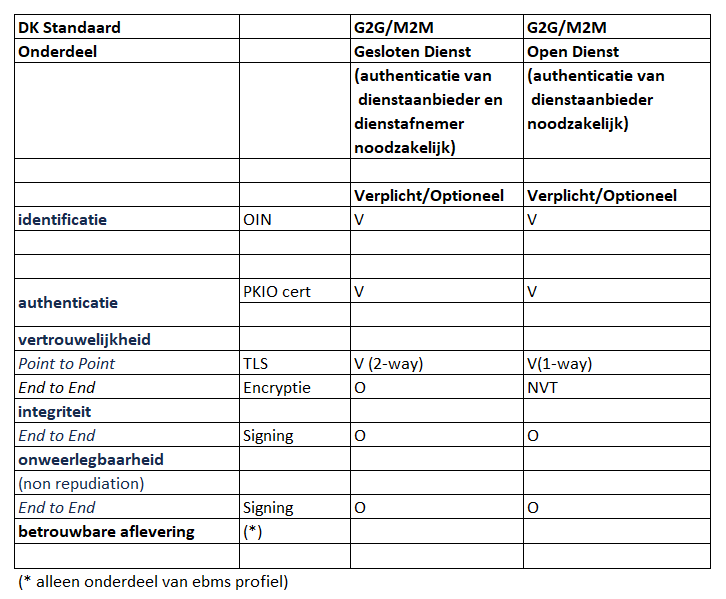

Digikoppeling en Restful Api's

Themasessie 25 juni 2020

## Agenda

Doel: Bepalen hoe APi's in te bedden in de standaard

- Terugkoppeling Enquête
- Bespreken onderwerpen
  - Bespreken van de scope
  - Herzien Digikoppeling Architectuur
- Afspraken voor vervolg

## Terugkoppeling Enquête (1)

De enquête is verstuurd naar actieve leden van het Technisch Overleg Digikoppeling

|aantal| #|
|---|---|
|aantal verstuurd:| 29|
|aantal reacties ontvangen:| 16 |

## Terugkoppeling Enquête (2)

## Wat moet de scope van Digikoppeling zijn? (1)

## Wat moet de scope van Digikoppeling zijn? (2)

## Wat moet de scope van Digikoppeling zijn? (3)

**Scenario 2** 
*(àl het verkeer met de overheden)*

- onderscheid maken steeds minder relevant
- gebruik registraties en transactiesystemen van de overheid door zowel overheden als private partijen
- profielen voor open als closed data nodig|

## Wat moet de scope van Digikoppeling zijn? (4)

**Scenario 3** 
*(uitwisseling van `closed data` tussen overheden onderling)*

- ook voor (semi) publieke sector en serviceproviders
- Als er een alternatief is (NEN3610 of API of ..) géén verplichting
- geen voorzieningen delen met de markt

## Eén ander scenario werd genoemd

- de uitwisseling van data tussen overheden onderling en met organisaties die een publieke taak vervullen. Of de data open of gesloten is maakt daarbij niet uit

## Behoefte waarin Digikoppeling voorziet

`Standaardisatie leidt tot:`

- meer duidelijkheid
- betere interoperabiliteit
- eenvoudiger toegang tot gegevens
- lagere kosten
- veiligheid 
- betrouwbaarheid

## Waar willen we heen met Digikoppeling?

Veel verschillende opvattingen. 
Het is lastig een tendens te herkennen of een gezamenlijk thema te ontwaren: 

- behoud het voordeel van een gedragen standaard
- het inbedden van Restful APi's is gewenst
- liever geen product, maar blijf bij een specificatie
- volg de praktijk op de voet

## Hoe moeten we Restful APi's opnemen in Digikoppeling?

- Maak geen onderscheid in meldingen en bevragingen. 
- beschrijf interactiepatronen, en usecases voor CRUD, Resources en betrouwbaarheid. 
- Beschrijf best practices voor business transactions.

## Nabranders

- zorg dat er voldoende referentie-implementaties en testmiddelen zijn
- onderzoek ook de rol die intermediairs  hebben 
- maak duidelijk  wat je met een API wél kan, wat met ebMS of WUS níet kan 
- met NLX kan je een API 6000x per seconde aanroepen, met Digikoppeling 6 ebMS berichten per seconde
- hoe verhoudt DK architectuur zich tot NORA en de NORA katernen?
- en gelukkig ook: **veel succes**

## Oordeel over deze enquête (1)

|||
|--|--|
|||

## Vragen 

Volledige uitwerking van de enquête
- <http://test-docs.centrumvoorstandaarden.nl/Overige/Enquete-RESTful-APIs-in-Digikoppeling/Enquete-RESTful-APIs-in-Digikoppeling-0.20/>

Deze presentatie
- <https://github.com/centrumvoorstandaarden/Enquete-RESTful-APIs-in-Digikoppeling/blob/master/presentatie.md>

## Discussie

- Scope Variant: G2G Open & Gesloten Diensten (Peter)
- Digikoppeling API Profiel
- Hoe komt Digikoppeling Architectuur er uit te zien? (Pieter)
- hoe nu verder en afspraken

## Scope Variant: G2G Open & Gesloten Diensten

## Toelichting 

Het kan wenselijk zijn om 'open data' wel via een betrouwbaar/veilig kanaal te ontvangen omdat het 'kritisch' is voor de bedrijfsprocessen van een organisatie;
(bv zekerheid van afzender en integriteit van de data).
Het onderscheid tussen *open en gesloten diensten* is daarom geschikter dan het onderscheid tussen *open/gesloten data* 
- Open Diensten: diensten zonder toegangsbeperking bv open data.
- Gesloten Diensten: diensten met toegangsbeperking bv persoonsgegevens en vertrouwelijke gegevens of diensten voor specifieke partijen.

## Profielen voor DK G2G Open/Gesloten Diensten

## Opmerkingen bij scenario DK G2G Open/Gesloten Diensten
- Omdat deze scope G2G publieke diensten invult, wordt eigenlijk het gehele publieke vlak ingevuld: G2x Open Diensten
- DK krijgt hiermee 2 functies:
  - Wat gebruik je voor publieke diensten (G2x)
  - Wat gebruik je voor G2G 'gesloten' diensten  
- Huidige PTLU scope sluit gevallen waar geen authenticatie van afnemers nodig is juist uit van verplicht gebruik van DK
- Vraag is (dus) of deze scope / indeling voordelen biedt?
(in vergelijking met een focus op G2G gesloten diensten)

## Profiel op API Design Rules
  
  DUO heeft een REST/SAAS profiel in ontwikkeling!
  - refereert aan **API Design Rules** en **API Design Rules Extensions** 

## EDUkoppeling REST Profiel (1/2)

Uit het EDU Restprofiel:

- Het functionele toepassingsgebied van het REST/SaaS-profiel betreft M2M gegevensuitwisseling via een beveiligde point-to-point verbinding waarbij RESTful standaarden worden toegepast. 
- Het wordt gebruikt voor bevragingen (pull) en meldingen (push) op basis van een request-response uitwisselingspatroon. De client is in deze context geen browser, maar een systeem (applicatie).

## EDUkoppeling REST Profiel (2.2)

Een organisatie heeft verschillende soorten API's:
- *Open API':s* voor ontsluiten van diensten zonder toegangsbeperking bv open data.
- *Gesloten API's:* voor ontsluiten van diensten met toegangsbeperking bv persoonsgegevens en vertrouwelijke gegevens of diensten voor specifieke partijen.
Zoals eerder aangegeven is dit profiel bedoeld voor vertrouwelijke gegevensuitwisseling en betreft dus gesloten API’s. In termen van het Kennisplatform API’s wordt gesteld dat het REST/SaaS-profiel wordt toegepast bij access-restricted and purpose-limited API’s.

## Hoe komt Digikoppeling Architectuur er uit te zien?

- Overzicht profielen
- Overzicht tranactiepatronen (nieuw)
- Rollen: End-to-end, verwerker, intermediair, SAAS dienstverlener 
- Overzicht use cases (nieuw)
- Bevragingen en Meldingen
  1. Moeten we deze begrippen handhaven of niet meer noemen?
     - push/pull
     - synchroon/asynchroon
     - best effort/betrouwbaar
  2. Geen koppeling met profielen

## Hoe verder?

- uitwerken resultaten
- volgende meeting TO in September

